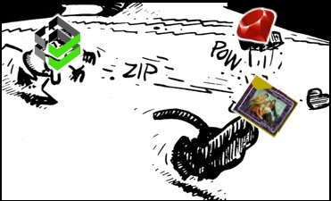

# Recreate the Ruby puppet server

---

> 🤖 LLM/AI WARNING 🤖
>
> This project was partially written by [Claude](https://claude.ai/) using Sonnet
> 4.5. It has been reviewed and tested, but use in production at your own
> discretion.
>
> 🤖 LLM/AI WARNING 🤖

---

#### Table of Contents
<!-- vim-markdown-toc GFM -->

* [Description](#description)
* [Architecture](#architecture)
* [Setup](#setup)
  * [Requirements](#requirements)
  * [Getting the Go CA](#getting-the-go-ca)
  * [Beginning with simp-webrick](#beginning-with-simp-webrick)
    * [Running from Ruby](#running-from-ruby)
    * [Running in podman (recommended)](#running-in-podman-recommended)
      * [Full stack with Go CA](#full-stack-with-go-ca)
      * [Standalone Compiler (no CA)](#standalone-compiler-no-ca)
      * [Master only (Behind Passenger)](#master-only-behind-passenger)
    * [Running in minikube](#running-in-minikube)
* [Testing](#testing)
  * [Compose (podman)](#compose-podman)
  * [Minikube](#minikube)
* [Go CA API Reference](#go-ca-api-reference)
* [TODO](#todo)

<!-- vim-markdown-toc -->

## Description

* Want an easy-to-scale Puppet Server that's quick to start and a LOT lighter
  than [Trapperkeeper]?
* Missing the days of running `puppet master --no-daemonize --debug --verbose`
  to debug your janky server-side compiles?
* Good news: **This project is for you!**

Forked from https://github.com/puppetlabs/puppet, commit [`fd4024d`]—the final
commit before the tragic merge of [puppet#6794].

:fire::warning::fire:
WARNING: **MASSIVE WORK IN PROGRESS** _(…but it seems to work :-D)_
:fire::warning::fire:

## Architecture

This project has two components that work together:

```
┌─────────────────────────────────────────────────────────┐
│                     Puppet Agents                        │
└──────────────────────┬──────────────────────────────────┘
                       │ HTTPS :8140
          ┌────────────▼────────────┐
          │   simp-webrick          │
          │   (this repo)           │
          │   Passenger + Apache    │
          │   Puppet 8 master       │
          └────────────┬────────────┘
                       │ HTTP :8140 (internal)
                       │  proxy /puppet-ca/v1/*
          ┌────────────▼────────────┐
          │   puppet-ca             │
          │   (Go CA — see below)   │
          │   Certificate Authority │
          └─────────────────────────┘
```

The **master** (`simp-webrick`) handles catalog compilation, file serving, and
report submission.  All certificate operations (signing CSRs, issuing certs,
managing the CRL) are delegated to the **Go CA** (`puppet-ca`).

On startup the master bootstraps its own TLS certificate from the Go CA via
its HTTP API, then serves agents over HTTPS.  The CRL is refreshed
automatically in the background based on the CRL's own `nextUpdate` field.

## Setup

### Requirements

For the full stack (recommended):

* [podman] + [podman-compose] ≥ 1.5, **or** [docker] + [docker compose] (v2) / [docker-compose] (v1)
* The **Go puppet-ca** binary or container image (see [Getting the Go CA](#getting-the-go-ca))

For the Minikube / Kubernetes path:

* All of the above, plus [minikube] and [kubectl]

For executing the master directly with Ruby (no CA integration):

* [Ruby]
* [Bundler]

### Getting the Go CA

Clone [golang-puppet-ca](https://github.com/trevor-vaughan/golang-puppet-ca) into a
sibling directory (the default build context):

```sh
git clone https://github.com/trevor-vaughan/golang-puppet-ca ../puppet-ca
```

The default build context for the CA service is `../puppet-ca` (a sibling directory of
this repo).  If your clone is elsewhere, set `PUPPET_CA_SRC` before running Compose:

```sh
# Option 1: inline environment variable
PUPPET_CA_SRC=/path/to/puppet-ca podman-compose up --build   # podman
PUPPET_CA_SRC=/path/to/puppet-ca docker compose up --build   # docker

# Option 2: .env file (copy the example and edit)
cp .env.example .env
# edit .env and uncomment/set PUPPET_CA_SRC
podman-compose up --build   # podman
docker compose up --build   # docker
```

If you have the Go CA source locally already, build its image manually:

```sh
podman build -t puppet-ca:latest /path/to/puppet-ca   # podman
docker build -t puppet-ca:latest /path/to/puppet-ca   # docker
```

### Beginning with simp-webrick

#### Running from Ruby

Runs the Puppet master only (no CA).  Useful for catalog-compilation debugging.

```sh
bundle update
bundle exec ruby puppet_server --no-daemonize --debug -v
```

#### Running in podman (recommended)

##### Full stack with Go CA

The `docker-compose.yml` starts three services: the Go CA, the Puppet master
(Passenger/Apache), and an example client that bootstraps against them.

```sh
# From the simp-webrick directory (podman or docker — detected automatically):
podman-compose up --build   # podman
docker compose up --build   # docker
```

Services and exposed ports:

| Service         | Internal address     | External port |
|-----------------|----------------------|---------------|
| `puppet-ca`     | `puppet-ca:8140`     | `8141`        |
| `puppet-master` | `puppet-master:8140` | `8140`        |

The master proxies `/puppet-ca/v1/*` requests to the CA automatically.
Agents only need to talk to the master on port 8140.

Environment variables accepted by the master container:

| Variable          | Default         | Description                              |
|-------------------|-----------------|------------------------------------------|
| `PUPPET_CA_HOST`  | `puppet-ca`     | Hostname of the Go CA service            |
| `PUPPET_CA_PORT`  | `8140`          | Port of the Go CA service                |
| `PUPPET_FQDN`     | `facter fqdn`   | Override the master's SSL cert CN        |

##### Standalone Compiler (no CA)

```sh
podman build --tag "puppet_webrick" --file Dockerfile
podman run --hostname puppet -p 8140:8140 -d puppet_webrick
```

##### Master only (Behind Passenger)

```sh
podman build --tag "puppet_passenger" --file Dockerfile.passenger
podman run --hostname puppet -p 8140:8140 -d puppet_passenger
```

#### Running in minikube

> **TODO**: The k8s manifests in `k8s/` reference locally-loaded images.
> Until the Go CA is published, you must build and load both images manually
> before applying the manifests.

```sh
# Build all images and apply manifests in one step.
# Starts minikube automatically if not already running.
# Set PUPPET_CA_SRC if the puppet-ca source is not at ../puppet-ca.
PUPPET_CA_SRC=/path/to/puppet-ca k8s/minikube-deploy.sh
```


Exposed node ports:

| Service         | NodePort |
|-----------------|----------|
| `puppet-master` | `30140`  |
| `puppet-ca`     | `30141`  |

## Testing

Integration tests cover the full stack: Go CA, Puppet master proxy, agent
bootstrap, mTLS endpoints, and certificate revocation enforcement.  Tests
follow TAP conventions (`ok N - desc` / `not ok N - desc`) and exit non-zero
if any test fails.

### Compose (podman)

```sh
rake test:integration        # auto-start stack if needed, run tests
rake test:integration:full   # always start a fresh stack, run tests, tear down
```

`rake test:integration` probes the CA HTTP endpoint on port 8141 to detect
whether the compose stack is already running:

* **Stack not running** — starts it with `podman-compose up -d`, runs the
  tests, then tears it down on exit.
* **Stack already running** — runs the tests against it and leaves it up.

To run the test script directly:

```sh
./test/integration.sh        # against an already-running stack
./test/integration.sh --up   # start → test → tear down
./test/integration.sh --up --keep  # start → test → leave running
```

### Minikube

```sh
rake test:integration:k8s   # deploys automatically if not already healthy, then tests
```

`rake test:integration:k8s` calls `k8s/minikube-deploy.sh`, which is idempotent:
it skips the build/load/apply cycle if all three deployments are already
healthy.  Pass `--force` to rebuild even when the stack is up:

```sh
k8s/minikube-deploy.sh --force
rake test:integration:k8s

# or run the test script directly against an already-deployed stack:
./test/integration.sh --k8s
```

## Go CA API Reference

The Go CA exposes the Puppet CA HTTP API at both bare paths and the
`/puppet-ca/v1/` prefix.  All requests are plain HTTP (no TLS).

| Method   | Path                                              | Description                          |
|----------|---------------------------------------------------|--------------------------------------|
| `GET`    | `/puppet-ca/v1/certificate/ca`                    | Fetch the CA certificate             |
| `GET`    | `/puppet-ca/v1/certificate/<name>`                | Fetch a signed certificate           |
| `GET`    | `/puppet-ca/v1/certificate_revocation_list/ca`    | Fetch the CRL                        |
| `GET`    | `/puppet-ca/v1/certificate_request/<name>`        | Fetch a pending CSR                  |
| `PUT`    | `/puppet-ca/v1/certificate_request/<name>`        | Submit a CSR (body: PEM text)        |
| `DELETE` | `/puppet-ca/v1/certificate_request/<name>`        | Delete a pending CSR                 |
| `GET`    | `/puppet-ca/v1/certificate_status/<name>`         | Get cert status                      |
| `PUT`    | `/puppet-ca/v1/certificate_status/<name>`         | Update cert status (sign/revoke)     |
| `DELETE` | `/puppet-ca/v1/certificate_status/<name>`         | Delete a certificate/request         |
| `GET`    | `/puppet-ca/v1/certificate_statuses/all`          | List all cert statuses (`?state=` filter supported) |
| `GET`    | `/puppet-ca/v1/expirations`                       | CA certificate and CRL expiry info   |
| `POST`   | `/puppet-ca/v1/sign`                              | Sign a pending CSR (subject in body) |
| `POST`   | `/puppet-ca/v1/sign/all`                          | Sign all pending CSRs                |
| `POST`   | `/puppet-ca/v1/generate/<name>`                   | Generate and sign a cert server-side |

Example: revoke a certificate

```sh
curl -X PUT \
     -H "Content-Type: application/json" \
     -d '{"desired_state":"revoked"}' \
     http://localhost:8141/puppet-ca/v1/certificate_status/client.localdomain
```

## TODO

* [x] Autoscale puppetmaster compilers as a cluster
* [x] Delegate all CA operations to a lightweight Go CA
* [x] Full agent bootstrap: CSR → signed cert → catalog compile → apply
* [x] CRL revocation and automatic CRL refresh on master
* [x] Publish the Go puppet-ca to GitHub → [trevor-vaughan/golang-puppet-ca](https://github.com/trevor-vaughan/golang-puppet-ca)
* [ ] Persistent volumes for CA state and environment code (currently `emptyDir`)
* [ ] Attach and document real Puppet clients (non-container)
* [ ] Compare and contrast to the "real thing" (openvox-server / Trapperkeeper)
* [ ] Ingress / TLS termination docs for the minikube cluster

[ruby]: https://www.ruby-lang.org
[bundler]: https://bundler.io
[podman]: https://podman.io
[podman-compose]: https://github.com/containers/podman-compose
[docker]: https://docs.docker.com/engine/install/
[docker compose]: https://docs.docker.com/compose/
[docker-compose]: https://docs.docker.com/compose/install/standalone/
[minikube]: https://minikube.sigs.k8s.io/docs/start/
[kubectl]: https://kubernetes.io/docs/tasks/tools/
[`fd4024d`]: https://github.com/puppetlabs/puppet/tree/fd4024d
[trapperkeeper]: https://github.com/puppetlabs/trapperkeeper
[puppet#6794]: https://github.com/puppetlabs/puppet/pull/6794
